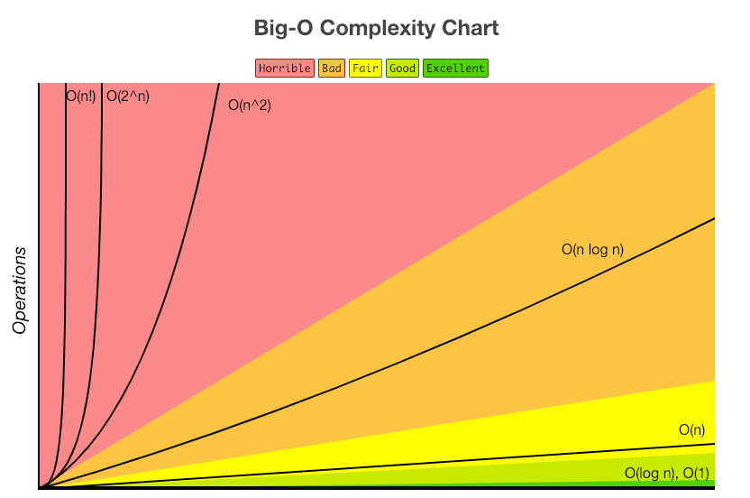

# Algorithm

---

## 시간 복잡도

> 알고리즘이란 어떤 목적을 달성하거나 결과물을 만들어내기 위해 거쳐야 하는 일련의 과정들을 의미한다. 해결하는 방법은 다양하며 여러가지 상황에
> 따른 알고리즘은 모두 다르다. 따라서 시간 복잡도가 낮은 알고리즘을 선택하여 사용한다.

알고리즘의 실행 시간을 두 부분으로 나누면
1. 입력값의 크기에 따라 알고리즘의 실행시간을 검증해 볼 수 있다.
2. 입력값의 크기에 따른 함수의 증가량, 이것을 성장률이라고 부른다. 이때 중요하지 않는 상수와 계수들을 제거하면 알고리즘의 실행시간에 중요한 성장률에
집중할 수 있는데 이것을 점금적 표기법(Asymptotic notation)이라 부른다. 점근적은 가장 큰 영향을 주는 항만 계산한다는 의미다.


이러한 점근적 표기법은 다음 세가지가 있으며 시간 복잡도를 나타내는데 사용된다.
* 최상의 경우: 오메가 표기법 (Big-Ω Notation)
* 평균의 경우: 세타 표기법 (Big-θ Notation)
* 최악의 경우 : 빅오 표기법 (Big-O Notation)

**_Big-o 표기법을 사용하는 이유:_** 평균을 나타내는 세타 표기법이 가장 이상적이고 정확하지만, 도출하기가 상대적으로 어려워서 알고리즘의
최악의 경우를 판단하면 평균과 가까운 성능으로 예측이 가능하여 Big-O 표기법을 사용한다.

### 빅오 표기법 (Big-O)



빅오 표기법은 불필요한 연산을 제거하여 알고리즘 분석을 쉽게 할 목적으로 사용된다.

Big-O로 측정되는 복잡성에는 시간과 공간복잡도가 있다.
* ***시간복잡도***는 입력된 N의 크기에 따라 실행되는 조작의 수를 나타낸다.
* ***공간복잡도***는 알고리즘이 실행될때 사용하는 메모리의 양을 나타낸다. 하지만 요즘에는 데이터를 저장할 수 있는 메모리의 발전으로 중요도가 낮아졌다.

### 시간 복잡도
> 시간복잡도의 가장 간단한 정의는 알고리즘의 성능을 설명하는 것이다. 다른 의미로는 알고리즘을 수행하기 위해 프로세스가 수행해야하는 연산을 수치화 한 것이다.
> 실행 시간이 아닌 연산 수치로 판별하는 이유는 명령어의 실행 시간은 컴퓨터의 하드웨어 또는 언어에 따라 편차가 크게 달라지기 때문에 명령어의
> 실행 횟수만을 고려하는 것이다.

```text
O(1) – 상수 시간 : 문제를 해결하는데 오직 한 단계만 처리함.
O(log n) – 로그 시간 : 문제를 해결하는데 필요한 단계들이 연산마다 특정 요인에 의해 줄어듬.
O(n) – 직선적 시간 : 문제를 해결하기 위한 단계의 수와 입력값 n이 1:1 관계를 가짐.
O(n log n) : 문제를 해결하기 위한 단계의 수가 N*(log2N) 번만큼의 수행시간을 가진다. (선형로그형)
O(n^2) – 2차 시간 : 문제를 해결하기 위한 단계의 수는 입력값 n의 제곱.
O(C^n) – 지수 시간 : 문제를 해결하기 위한 단계의 수는 주어진 상수값 C 의 n 제곱.
```

---

## Linked List

* _**배열**_
  * 배열은 메모리 상에서 연속적인 공간을 할당받아 데이터를 저장한다. 배열은 원소에 접근할 떄 _인덱스_ 라는 개념을 사용한다. 즉 인덱스는 배열에서
원소의 데이터 주소를 가리키는 유일한 식별자이다. 이를 통해 아주 빠르게 특정 원소에 접근할 수 있다는 장점이 있다. 하지만 이런 특징으로 인해 원소의
삽입 / 삭제는 느리다. 대상 원소의 뒤 원소들의 모든 위치를 변경 해주는 추가 작업이 필요하기 때문이다.


* _**리스트**_
  * 리스트의 각 원소는 메모리 상 연속적인 공간에 할당되지 않을 수 있다. 즉, 첫 번째 원소의 주소를 알더라도 그 다음 원소의 주소를 단순히 계산할 수 없다는 것이다.
리스트의 각 원소는 다음 원소를 가리키는 **포인터(Pointer)** 등을 사용하여 각 원소의 순서를 구현한다. 이런 특징으로 배열보다 데이터의 삽입 / 삭제가 빠르다.
앞, 뒤 원소의 포인터만 바꿔주면 되기 때문이다. 하지만, 인덱스를 사용하여 특정 원소에 직접 접근이 불가능하기 때문에 원소를 검색하기 위해서는 첫 번째 원소부터
선형 검색 (Linear Search) 해야하는 단점이 있다.


링크드 리스트의 각 원소는 노드 (Node) 라고 한다. 각 노드는 데이터와 그 다음 노드를 가리키는 포인터 (Pointer)를 가지고 있다. 링크드 리스트의 맨 앞과
맨 끝 노드를 각각 머리 (Head), 꼬리 (Tail) 노드라고 한다. 각 노드의 앞쪽 노드를 전임 노드 (Predecessor Node), 뒤쪽 노드를 후임 노드 (Successor Node) 라고 한다.


---

### Reference

https://blog.chulgil.me/algorithm/

https://hudi.blog/ds-linked-list/

