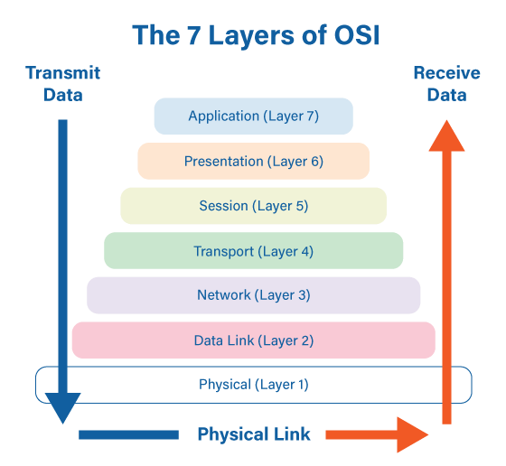

# Network

---

# OSI 7 계층

---

> **OSI 7**
> 
> **_국제표준화기구(ISO)에서 개발한 모델로서, 네트워크 프로토콜 디자인과 통신 과정을 7개의 계층으로 구분하여
> 만든 표준 규격이다._** 

- **_Application Layer (응용 계층)_**
  - **최종 목적지로 응용 프로그램과 연관하여 서비스를 수행하는 계층**
  - 사용자와 직접 접하는 유일한 계층.
  - EX) HTTP, DNS, FTP...

- **_Presentation Layer (표현 계층)_**
  - **데이터 압축, 변환이 이뤄지는 계층** 
  - 응용 계층으로부터 전달 받거나 전송하는 데이터의 인코딩 - 디코딩 및 암호화 등이 이루어지는 계층.
  - 코드 간의 번역을 담당하여 데이터의 형식상 차이를 다루는 부담을 응용 계층으로부터 덜어준다.
  - EX) JPEG, MPEG, AFP

- **_Session Layer (세션 계층)_**
  - **데이터가 통신하기 위한 논리적 연결을 담당하는 계층**
  - 통신 세션을 구성하는 계층으로, 포트 (Port) 번호를 기반으로 연결한다.
  - TCP/IP 세션을 만들고 없애는 역할
  - 통신하는 사용자들을 동기화하고 오류 복구 명령들을 일괄적으로 다룬다.
  - 네트워크 상 양쪽 연결을 관리하고 연결을 지속시켜주는 계층
  - _Session_ -> 클라이언트와 웹 서버 간 네트워크 연결이 지속적으로 유지되고 있는 상태

- **_Transport Layer (전송 계층)_**
  - **종단 간의 사용자들에게 신뢰성 있는 데이터를 전달하는 계층**
  - 패킷의 전송이 유효한지 확인하고, 전송에 실패된 패킷을 다시 보내는 것과 같은 신뢰성 있는 통신을 보장한다.
  - 흐름 제어: 송신측과 수신측 사이의 데이터 처리 속도 차이를 제어
  - 혼잡 제어: 네트워크 혼잡을 피하기 위해 데이터의 전송 속도 제어
  - 오류 제어: 오류 검출과 재전송

- **_Network Layer (네트워크 계층)_**
  - **IP를 지정하고 라우터로 경로를 선택해 네트워크를 통해 패킷을 전달하는 계층**
  - 전송되는 데이커는 패킷 단위로 분할하여 전송한 후 다시 합쳐진다.

- **_DataLink Layer (데이터 링크 계층)_**
  - **신뢰성 있는 전송을 보장하기 위한 계층**
  - 물리적인 네트워크 사이에 데이터 전송을 담당하는 계층
  - MAC(맥) 주소를 가지고 통신
  - 패킷을 프레임(Frame)으로 구성하여 물리 계층으로 전송
  - 묶여있는 호스트-노드 또는 노드-노드 사이에서의 신뢰성 관련 기능을 제공한다.

- **_Physical Layer (물리 계층)_**
  - **전기적, 물리적 세부 사항을 정의하는 계층**
  - 단지 데이터를 전달만 할 뿐, 전송받으려는 데이터가 무엇인지, 어떤 에러가 있는지는 전혀 신경 쓰지 않는다.
  - 상위 계층(데이터 링크)에서 전송된 데이터를 물리적인 전송 매체(허브, 라우터, 케이블 등)를 통해  다른 시스템에
    전기적 신호를 전송하는 역할

## 전송 계층

> **전송 계층과 데이터 링크 계층의 차이?**
> 
> 전송 계층은 논리적으로 1:1 연결된 송신, 수신 호스트 즉 종단간의 호스트에 관한 신뢰성 관련 기능을 제공하고,
> 데이터 링크 계층은 물리적으로ㅓ 1:1 연결된 호스트 사이의 전송 즉 직접 묶여있는 호스트-노드 또는 노드-노드 사이에서의 
> 신뢰성 관련 기능을 제공한다.

* **_TCP 패킷 추적 관리_**
  * 데이터는 패킷 단위로 쪼개져 같은 목적지로 전송된다.
  * 따라서 패킷에 각각 번호를 부여하여 패킷의 분실 확인 처리를 하기 위해 목적지에서 패킷을 재조립한다.

* **_흐름 제어_**
  * 송신측과 수신측 사이의 데이터 처리 차이를 제어하기 위한 기법으로 송신측의 데이터 처리 속도를 조절하여 수신자의 버퍼 오버플로우를 방지한다.
  * 슬라이딩 윈도우를 사용한다.
    * 송신 측에서 0,1,2,3,4,5,6을 보낼 수 있는 프레임을 가지고 있고 0,1을 전송했다면 슬라이딩 윈도우 구조는 2,3,4,5,6으로 변한다.
    * 수신측에서 ACK를 보내게 되면 송신측은 이전에 보낸 데이터 0,1을 수신측에서 정상적으로 받았음을 알게 되고 ACK 개수 만큼 프레임의 수를 
    오른쪽으로 확장한다.

* **_오류 제어_**
  * 프레임이 손상되었거나 손실되었을 경우, 재전송을 통해 오류를 복구한다.
  * 이때 2가지 방식이 있다.
    * Stop and Wait ARQ
      * 수신측에서 ACK 또는 NAK를 보낸다.
      * 수신측에서 받지 못하는 경우 NAK를 보내고 송신측은 해당 데이터를 재전송한다.
      * 만약 분실된 경우 일정한 간격의 시간을 두고 타임 아웃이 되면 송신측에서 재전송한다.
    * Go-Back-n ARQ
      * 손상되거나 분실된 경우 확인된 마지막 프레임 이후로 모든 프레임을 재전송한다.
      * 예를 들어 수신측에서 1, 3을 받게 되면 3을 버리고 2를 받지 못했다고 송신측에 보내고 송신측은 2부터 데이터를 다시 보낸다.
    * SR ARQ
      * Go-Back-n을 보완한 방법으로 손실된 프레임만 재전송한다.
      * 별도의 데이터 재정렬을 수행해야 하며, 별도의 버퍼를 필요로 한다.

* **_혼잡 제어_**
  * 네트워크 혼잡을 피하기 위해 송신측에서 보내는 데이터의 전송 속도를 제어하는 것
  * AIMD 방식
    * 처음 패킷 하나를 보내 문제가 없다면 Window Size를 1씩 증가시키는 방식
    * 문제가 발생하면 Window Size를 절반으로 줄인다.
    * 초기에 높은 대역폭을 사용하지 못하여 오랜 시간이 걸리고 네트워크가 혼잡해지는 상황을 미리 감지하지 못한다.
  * Slow Start 방식
    * 패킷을 2배씩 증가하여 데이터의 크기가 지수함수적으로 증가한다.
    * 전송되는 데이터의 크기가 임계값에 도달하면 혼잡 회피 단계로 넘어간다.
    * 혼잡 현상이 발생하면 Window size를 1로 줄인다.
    * 혼잡 현상이 발생했던 Window Size 절반 까지는 지수함수 꼴로 증가하고 이후부터는 1씩 증가한다.
  * Fast recovery 빠른 회복 방식
    * 혼잡 시 1로 줄이지 않고 절반으로 줄이고 선형 증가
  * 혼잡 회피
    * 임계값을 넘어가면 Window Size 1씩만 선형적으로 증가

---

# TCP/IP 4 계층

> **_TCP/IP란?_**
>
> TCP/IP는 IP(인터넷 프로토콜)와 TCP(전송 조절 프로토콜)의 묶음을 의미한다. 즉 두가지 프로토콜 방식을 조합하여 인터넷 통신하는 것을 TCP/IP 라고 부른다.
> 송신자가 수신자에게 IP를 사용하여 최대한 빠르게 패킷을 전송하면 TCP를 활용해 패킷을 정상적으로 수신 받는다.
> 이렇게 복수의 프로토콜 집합을 프로토콜 스택, 또는 프로토콜 스위트라고 부르며, 서로 다른 프로토콜 스택끼리는 통신할 수 없다.

* **IP (Internet Protocol)**
  * IP는 패킷 데이터들을 최대한 빨리 특정 목적지 주소로 보내는 프로토콜이다.
  * 빨리 보내는 것이 목적이기 때문에 패킷 전달 여부는 보증하지 않고 패킷을 보낸 순서와 받는 순서가 다를 수 있다.

* **TCP (Transmission Control Protocol)**
  * 패킷 통신은 작은 단위로 나누어 전송하기 때문에, 순서가 뒤섞이거나 내용이 유실될 수 있다는 단점이 있다.
  * 이러한 문제를 해결하기 위해 TCP 라는 프로토콜이 존재한다.
  * TCP는 패킷을 정상적으로 받을 수 있도록 하는 프로토콜이다.
  * 패킷 전달 여부를 보증하고, 패킷을 송신 순서대로 받게 해준다.
  * 즉, 목적지에 도착한 패킷들을 순서대로 정렬하고, 손상되거나 손실된 패킷이 있다면, 출발지에 재요청하는 방식으로 진행한다.

* 실제 사용되는 TCP/IP는 OSI 참조 모델을 기반으로 상업적이고 실무적으로 이용될 수 있도록 단순화된 모형이다
  * 네트워크 전송 시 데이터 표준을 정리한 것이 OSI 7계층, 이 이론을 실제 사용하는 인터넷 표준이 TCP/IP 4계층이다.

---

# DNS

---

### Reference
https://backendcode.tistory.com/167#article-3--3--%EA%B3%84%EC%B8%B5-%EA%B5%AC%EC%A1%B0
https://velog.io/@jehjong/%EA%B0%9C%EB%B0%9C%EC%9E%90-%EC%9D%B8%ED%84%B0%EB%B7%B0-TCPIP-4%EA%B3%84%EC%B8%B5
https://velog.io/@backtony